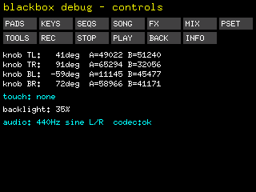

# blackbox-rs

Board support crate for the **Blackbox** board — STM32H743XI (Cortex-M7 @ 399.36 MHz, rev.Y), built on [Embassy](https://embassy.dev).

`blackbox_rs::init()` brings the whole board up at its design clocks and returns ready-to-use drivers:

- **11 LEDs**, **13 buttons**, **4 endless encoders** (absolute angle via ADC1)
- **GT9147 touchscreen** (I2C)
- **320×240 RGB565 display** — LTDC double-buffered, [`embedded-graphics`](https://crates.io/crates/embedded-graphics) draw target
- **CS42528 audio** — SAI1 I2S stereo out (headphone DACs), 48 kHz

The rev.Y cache erratum, SDRAM timings and the LTDC pin map are handled inside the crate.



## Quick start

```toml
[dependencies]
blackbox-rs = "0.1"
embassy-executor = { version = "0.10", features = ["platform-cortex-m", "executor-thread"] }
embassy-time = "0.5"
```

```rust
#![no_std]
#![no_main]

use embassy_executor::Spawner;
use blackbox_rs::buttons::Button;
use {defmt_rtt as _, panic_probe as _};

#[embassy_executor::main]
async fn main(_spawner: Spawner) {
    let mut board = blackbox_rs::init().await; // clocks, SDRAM, every peripheral, codec + SAI

    loop {
        if board.buttons.is_pressed(Button::Play) {
            defmt::info!("play!");
        }
        board.display.swap().await; // present at vblank
    }
}
```

`init()` returns a `Board { display, leds, buttons, knobs, touch, i2c, codec_ok, audio }`.

## Using the peripherals

```rust
board.leds.set(0, true);                     // or board.leds.only(3)

for b in Button::ALL {                       // typed, no magic indices
    if board.buttons.is_pressed(b) { defmt::info!("{}", b.label()); }
}

let r = board.knobs.read(Knob::Tl);          // absolute angle from two wipers
defmt::info!("TL = {} deg", r.angle_deg());

if let Some(tp) = board.touch.poll(&mut board.i2c) {
    defmt::info!("touch {},{}", tp.x, tp.y);
}

// Display — embedded-graphics on the back buffer, then swap
use embedded_graphics::{prelude::*, pixelcolor::Rgb565, primitives::*};
Circle::new(Point::new(160, 120), 40)
    .into_styled(PrimitiveStyle::with_fill(Rgb565::CYAN))
    .draw(&mut board.display.target()).ok();
board.display.swap().await;
board.display.set_backlight(20);             // percent, capped at 35%

// Audio — write interleaved L/R 24-bit samples; see examples/demo.rs for a sine task
let buf = [0u32; blackbox_rs::audio::HALF_BUFFER_LEN];
board.audio.write(&buf).await.unwrap();
```

`Button` and `Knob` have `::ALL`, `.index()` and `.label()`.

## Running the examples

```sh
rustup target add thumbv7em-none-eabihf
cargo install probe-rs-tools

cargo run --release --example demo        # full board: controls, panel, 440 Hz tone
cargo run --release --example audio_tone  # audio only — clocks + codec + SAI
```

A debug probe on SWD; `.cargo/config.toml` sets the `probe-rs run --chip STM32H743XI` runner.

## Hardware notes

- **rev.Y erratum ES0392** — D-cache stays off; the MPU marks SDRAM + D2 SRAM non-cacheable so LTDC/SAI DMA stay coherent without maintenance. Use Cargo feature `stm32h743` (not `stm32h743v`, which hangs ADC power-up).
- **Backlight capped at 35%** (`display::MAX_BACKLIGHT_PCT`) — boost-regulator thermal limit; `set_backlight` clamps.
- **Touch** latches its I2C address at the chip's own power-on from INT (PG12): `0x5D` operational / `0x14` degraded. It re-latches only on a real power cycle — if the log shows `@ 0x14`, power-cycle the board.
- Clocks: HSE 6.144 MHz → PLL1 399.36 MHz sysclk, PLL2 12.288 MHz SAI (256 × 48 kHz), PLL3 6.4 MHz LTDC.

| Block | Pins / notes |
|-------|--------------|
| Display LTDC | 25 pins AF14; panel power **PK7**; R2 not routed |
| Audio SAI1 | PE2 MCLK, PE5 SCK, PE4 FS, PB2 SD (AF6); CS42528 @ 0x4C |
| SDRAM FMC | AF12; 2× IS42S16160J, 64 MB @ 0xC000_0000 |
| I2C1 | PB6 SCL / PB7 SDA (AF4), 400 kHz; codec + touch share it |
| Touch GT9147 | INT **PG12** |
| Buttons ×13 | active-low; PA0/PA1/PC2/PC3 need the SYSCFG dual-pad fix |
| LEDs ×11 / Knobs ×4 | LEDs active-high; knobs = 8 wipers on ADC1, `atan2` angle |

## License

MIT OR Apache-2.0
